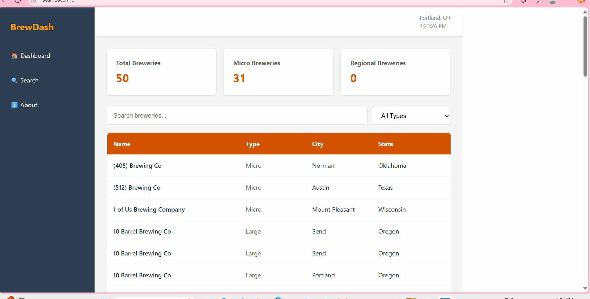

# Web Development Project 5 - *BrewDash: Brewery Dashboard Web App*

Submitted by: **Therese Elvira Mombou Gatsing**

This web app: **A responsive React dashboard that fetches data from the OpenBreweryDB API and displays brewery information by type, name, city, and state. Includes a real-time clock, search functionality, and filter controls for brewery type. Built with React, useEffect, and modern CSS for layout and styling. Perfect for practicing API calls, state management, and conditional rendering in React.**

Time spent: **7** hours spent in total

## Required Features

The following **required** functionality is completed:

- [x] **The site has a dashboard displaying a list of data fetched using an API call**
  - The dashboard should display at least 10 unique items, one per row
  - The dashboard includes at least two features in each row
- [x] **`useEffect` React hook and `async`/`await` are used**
- [x] **The app dashboard includes at least three summary statistics about the data** 
  - The app dashboard includes at least three summary statistics about the data, such as:
    - *insert details here*
- [x] **A search bar allows the user to search for an item in the fetched data**
  - The search bar **correctly** filters items in the list, only displaying items matching the search query
  - The list of results dynamically updates as the user types into the search bar
- [x] **An additional filter allows the user to restrict displayed items by specified categories**
  - The filter restricts items in the list using a **different attribute** than the search bar 
  - The filter **correctly** filters items in the list, only displaying items matching the filter attribute in the dashboard
  - The dashboard list dynamically updates as the user adjusts the filter

The following **optional** features are implemented:

- [x] Multiple filters can be applied simultaneously
- [x] Filters use different input types
  - e.g., as a text input, a dropdown or radio selection, and/or a slider
- [x] The user can enter specific bounds for filter values

The following **additional** features are implemented:

* No additional feature was implemented

## Video Walkthrough

Here's a walkthrough of implemented user stories:

<!-- Replace this with whatever GIF tool you used! -->
GIF created with ScreenToGif

## Notes

Describe any challenges encountered while building the app.
- I had challenges figuring out the search bar

## License

    Copyright [2025] [Therese Elvira Mombou Gatsing]

    Licensed under the Apache License, Version 2.0 (the "License");
    you may not use this file except in compliance with the License.
    You may obtain a copy of the License at

        http://www.apache.org/licenses/LICENSE-2.0

    Unless required by applicable law or agreed to in writing, software
    distributed under the License is distributed on an "AS IS" BASIS,
    WITHOUT WARRANTIES OR CONDITIONS OF ANY KIND, either express or implied.
    See the License for the specific language governing permissions and
    limitations under the License.
